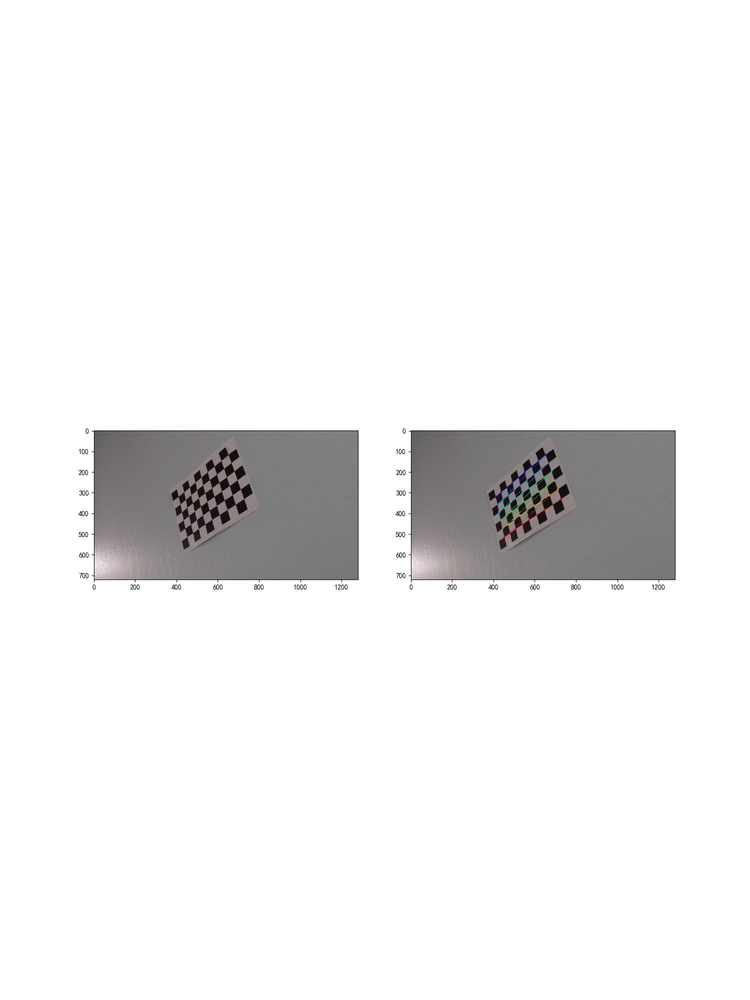

# laneDection

# 项目概述
4.0车道线检测实现项目简介汽车的不断扩大在给给给人们带来极大便利的同时，也导致了拥堵的交通路况，以及更为频发的交通事故。而自动驾驶技术的出现可以有效的缓解在人为因素导致的交通事故中，因汽车行驶正常轨道致使的交通事故占总事故的发生的50％，据此，发生了自动驾驶的最终任务就是准确的识别出车道线并根据车道线的指示进行转移。美国联邦公路局统计，如果能在事故前一秒能够以报警的方式提醒驾驶员，那么将避免90％的交通事故，如此惊人的数据能够证明车道线在自动驾驶的安全行驶中具有重要的意义。内部检测车道线的方法主要有两类：一类是基于模型的检测方法，还有一类是基于特征的检测方法。基于模型的检测方法是将车道创造一种合适的数学模型，并根据该模型对车道线进行拟合，原理就是在结构化的道路上根据车道线的 如何特征为车道线匹配合适的曲线模型，在采用最小二乘，Hough变换等方法对车道线进行拟合。常用的数学模型有直线型，抛物线模型以及样条曲线模型。这种方法对噪声抗干扰能力强。但也存在缺点端，即一种车道线模型不能同时适应多种道路场景。基于特征的检测方法是根据车道线自身的特征信息，通过该方法对车道线的边缘特征要求较大，在边缘特征明显的情况下可以更好的结果，但对噪声很敏感，鲁棒性较差。本项目针对车载摄像机获得的道路图像进行提取，主要是对图像进行校正，利用边缘提取和颜色阈值的方法提取车道线，利用透视变换将图像转换为透视图，利用直方图统计的方法确定左右车道位置，并利用最小二乘拟合车道，并利用透视变换将检测结果替换在图像上，最后计算车道线的曲率及车辆分散车道中央的距离，流程如下图所 示：该项目效果展示如下：
# 张氏标定法（相机矫正）

# 车道线检测之后（绿色为行驶区域）

