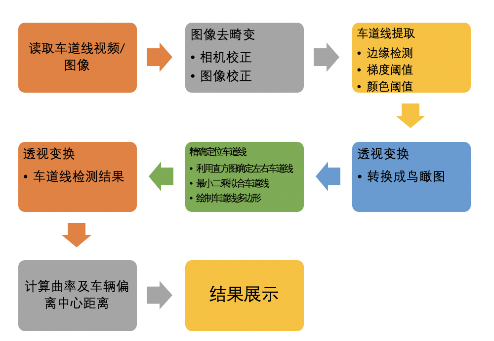
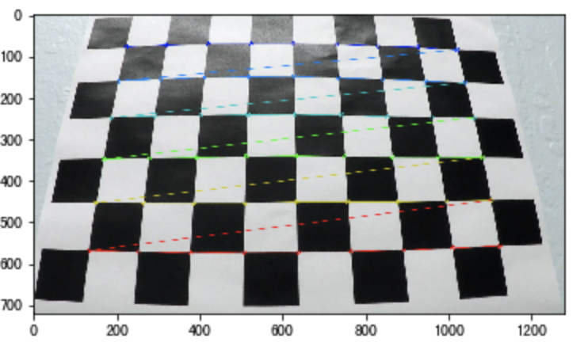
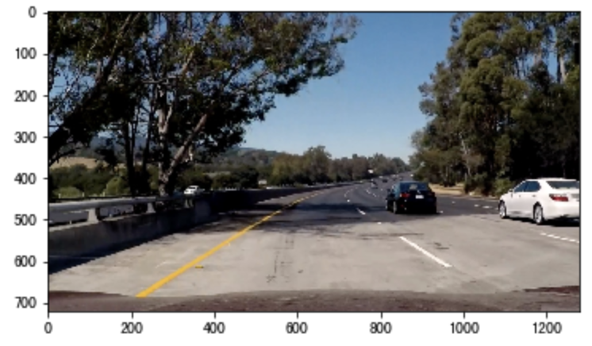
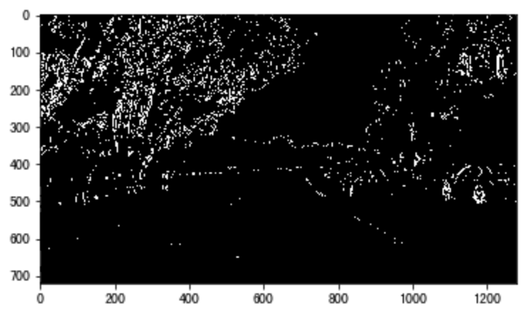
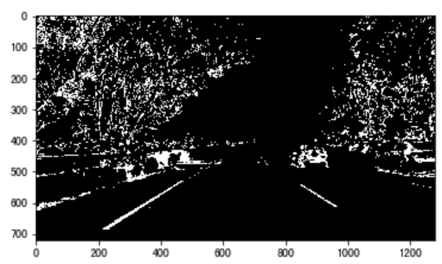
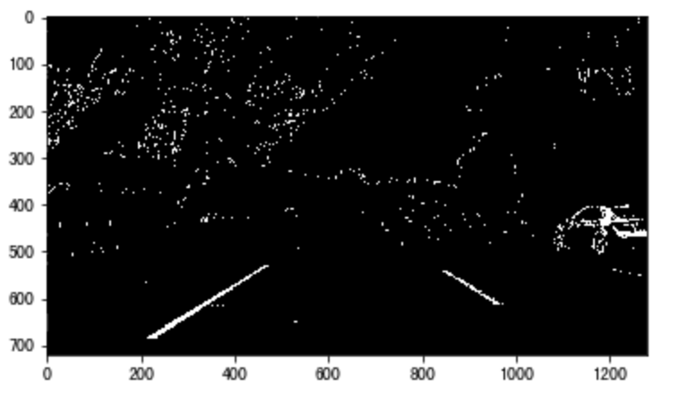
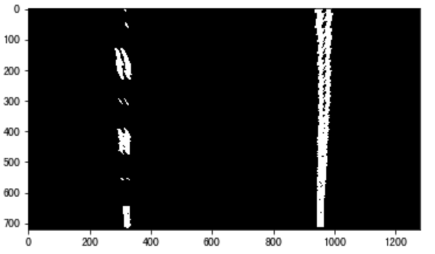
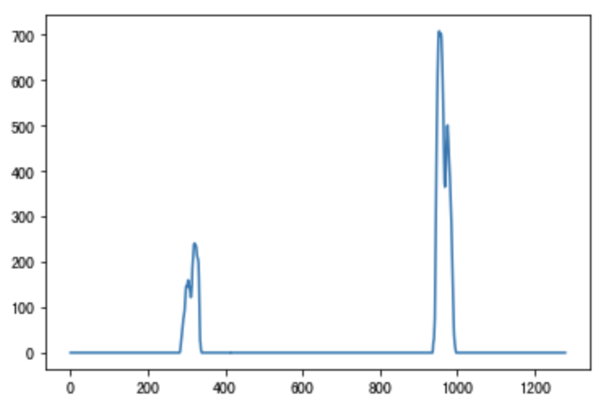
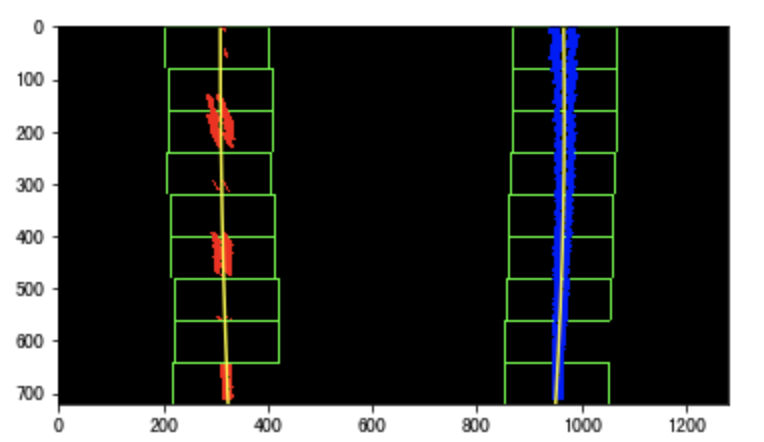
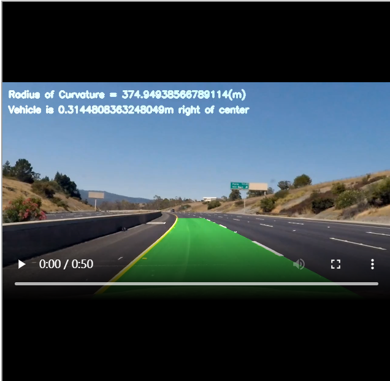

# laneDection

# 项目概述
4.0车道线检测实现项目简介汽车的不断扩大在给给给人们带来极大便利的同时，也导致了拥堵的交通路况，以及更为频发的交通事故。而自动驾驶技术的出现可以有效的缓解在人为因素导致的交通事故中，因汽车行驶正常轨道致使的交通事故占总事故的发生的50％，据此，发生了自动驾驶的最终任务就是准确的识别出车道线并根据车道线的指示进行转移。美国联邦公路局统计，如果能在事故前一秒能够以报警的方式提醒驾驶员，那么将避免90％的交通事故，如此惊人的数据能够证明车道线在自动驾驶的安全行驶中具有重要的意义。内部检测车道线的方法主要有两类：一类是基于模型的检测方法，还有一类是基于特征的检测方法。基于模型的检测方法是将车道创造一种合适的数学模型，并根据该模型对车道线进行拟合，原理就是在结构化的道路上根据车道线的 如何特征为车道线匹配合适的曲线模型，在采用最小二乘，Hough变换等方法对车道线进行拟合。常用的数学模型有直线型，抛物线模型以及样条曲线模型。这种方法对噪声抗干扰能力强。但也存在缺点端，即一种车道线模型不能同时适应多种道路场景。基于特征的检测方法是根据车道线自身的特征信息，通过该方法对车道线的边缘特征要求较大，在边缘特征明显的情况下可以更好的结果，但对噪声很敏感，鲁棒性较差。本项目针对车载摄像机获得的道路图像进行提取，主要是对图像进行校正，利用边缘提取和颜色阈值的方法提取车道线，利用透视变换将图像转换为透视图，利用直方图统计的方法确定左右车道位置，并利用最小二乘拟合车道，并利用透视变换将检测结果替换在图像上，最后计算车道线的曲率及车辆分散车道中央的距离，流程如下图所 示：该项目效果展示如下：

# 1.张氏标定法（相机矫正）
* 根据张正友校正算法，利用棋盘格数据校正对车载相机进行校正，计算其内参矩阵，外参矩阵和畸变系数。
* 标定的流程是：
* 准备棋盘格数据，即用于标定的图片
* 对每一张图片提取角点信息
* 在棋盘上绘制提取到的角点（非必须，只是为了显示结果）
* 利用提取的角点对相机进行标定 
* 获取相机的参数信息
## 1.1标定的图片
* 标定的图片需要使用棋盘格数据在不同位置、不同角度、不同姿态下拍摄的图片，最少需要3张，当然多多益善，通常是10-20张。
* 检测棋盘格数据的角点：
* cv2.findChessboardCorners（）
* 计算相机的内参数和外参数：
* cv2.calibrateCamera（）
* 标定效果如下图

## 1.2图像去畸变
* dst = cv2.undistort(img, mtx, dist, None, mtx)
* 参数
* Img: 要进行校正的图像
* mtx: 相机的内参
* dist: 相机的畸变系数
* 去畸变效果如下图：

# 2.车道线提取
* 在这里选用Sobel边缘提取算法，Sobel相比于Canny的优秀之处在于，它可以选择横向或纵向的边缘进行提取。从车道的拍摄图像可以看出，我们关心的正是车道线在横向上的边缘突变。
## 2.1流程
* 1.首先我们是把图像转换为HLS颜色空间，然后利用边缘检测和阈值的方法检测车道线，我们以下图为例，来看下检测结果：

* 2.利用sobel边缘检测的结果

* 3.利用S通道的阈值检测结果

* 4.将边缘检测结果与颜色检测结果合并，并利用L通道抑制非白色的信息：

# 3.透视变换
* 为了方便后续的直方图滑窗对车道线进行准确的定位，我们在这里利用透视变换将图像转换成俯视图，也可将俯视图恢复成原有的图像

# 4.车道线定位及拟合
## 4.1 定位思想
* 下图是我们检测到的车道线结果

* 沿x轴方向统计每一列中白色像素点的个数，横坐标是图像的列数，纵坐标表示每列中白色点的数量，那么这幅图就是“直方图”

## 4.2车道线拟合

# 车道线检测之后（绿色为行驶区域）

